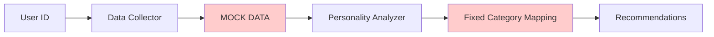
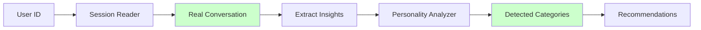
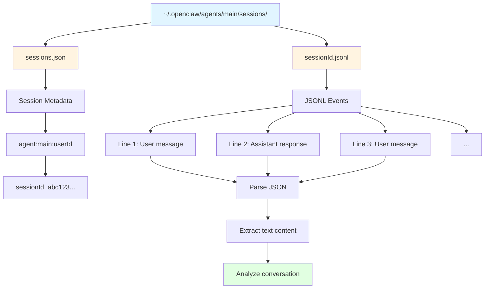
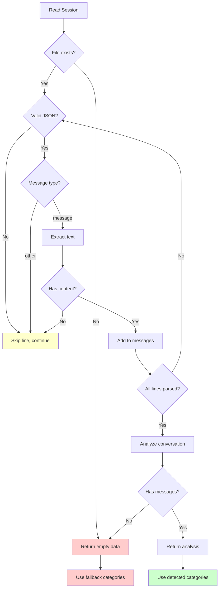
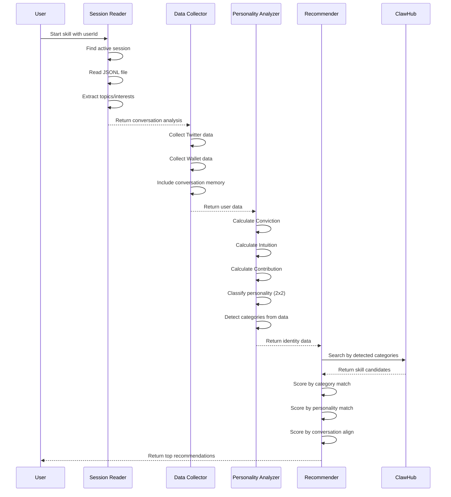
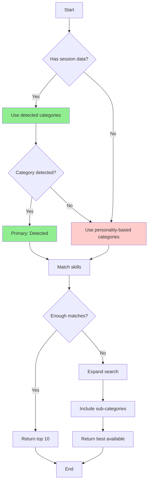

# Architecture Diagram: Conversation-Driven Recommendations

## System Architecture

```mermaid
graph TB
    A[User Conversation in OpenClaw] --> B[Session JSONL Files]
    B --> C[OpenClaw Session Reader]

    C --> D[Conversation Analysis]
    D --> E[Topics Extraction]
    D --> F[Interests Detection]
    D --> G[Preferences Identification]

    E --> H[Data Collector]
    F --> H
    G --> H

    H --> I[Personality Analyzer]

    I --> J[Calculate Conviction]
    I --> K[Calculate Intuition]
    I --> L[Calculate Contribution]

    J --> M[2x2 Quadrant Classification]
    K --> M
    L --> M

    M --> N{Contribution > 65?}
    N -->|Yes| O[The Cultivator]
    N -->|No| P[2x2 Classification]

    P --> Q{Conviction ≥ 50?}
    Q -->|Yes| R{Intuition ≥ 50?}
    Q -->|No| S{Intuition ≥ 50?}

    R -->|Yes| T[The Visionary]
    R -->|No| U[The Optimizer]
    S -->|Yes| V[The Explorer]
    S -->|No| W[The Innovator]

    T --> X[Detected Categories]
    U --> X
    V --> X
    W --> X
    O --> X

    F --> X

    X --> Y[Skill Discovery]
    Y --> Z[ClawHub Search]

    Z --> AA[Category Match 30pts]
    Z --> AB[Personality Match 20pts]
    Z --> AC[Conversation Align 15pts]
    Z --> AD[Dimension Bonus 15pts]

    AA --> AE[Final Recommendations]
    AB --> AE
    AC --> AE
    AD --> AE

    style A fill:#e1f5ff
    style B fill:#e1f5ff
    style C fill:#fff4e1
    style D fill:#fff4e1
    style H fill:#fff4e1
    style I fill:#ffe1f5
    style M fill:#ffe1f5
    style X fill:#e1ffe1
    style Y fill:#e1ffe1
    style AE fill:#e1ffe1
```

## Data Flow: Before vs After

### Before (Mock Data)

### After (Real Data)

## Recommendation Scoring

```mermaid
graph TD
    A[Skill Candidate] --> B{Category Match?}
    B -->|Yes| C[+30 points]
    B -->|No| D[Max 65 points]

    A --> E{Personality Match?}
    E -->|5 keywords| F[+20 points]

    A --> G{Conversation Align?}
    G -->|3 keywords| H[+15 points]

    A --> I{High Conviction?}
    I -->|≥70| J[+5 points]

    A --> K{High Intuition?}
    K -->|≥70| L[+5 points]

    A --> M{High Contribution?}
    M -->|≥65| N[+5 points]

    C --> O[Total Score]
    D --> O
    F --> O
    H --> O
    J --> O
    L --> O
    N --> O

    O --> P{Score ≥ 60?}
    P -->|Yes| Q[Recommended]
    P -->|No| R[Filtered Out]

    style C fill:#90ee90
    style F fill:#90ee90
    style H fill:#90ee90
    style Q fill:#90ee90
```

## Personality Classification (2x2 + Override)

```mermaid
graph TD
    A[Calculate Dimensions] --> B{Contribution > 65?}
    B -->|Yes| C[🩵 The Cultivator]
    B -->|No| D{Conviction ≥ 50?}

    D -->|Yes| E{Intuition ≥ 50?}
    D -->|No| F{Intuition ≥ 50?}

    E -->|Yes| G[💜 The Visionary<br/>High Conviction<br/>High Intuition]
    E -->|No| H[🧡 The Optimizer<br/>High Conviction<br/>Low Intuition]

    F -->|Yes| I[💚 The Explorer<br/>Low Conviction<br/>High Intuition]
    F -->|No| J[💙 The Innovator<br/>Low Conviction<br/>Low Intuition]

    style C fill:#add8e6
    style G fill:#dda0dd
    style H fill:#ffa07a
    style I fill:#90ee90
    style J fill:#87ceeb
```

## Session File Structure

## Error Handling Flow

## Component Interaction

## Key Decision Points

## Testing Flow

```mermaid
graph TD
    A[npm run test:conversation] --> B[Create test user ID]
    B --> C[Read session history]

    C --> D{Session found?}
    D -->|Yes| E[Display messages count]
    D -->|No| F[Skip to data collector]

    E --> G[Display topics]
    E --> H[Display interests]
    E --> I[Display preferences]

    G --> J[Collect user data]
    H --> J
    I --> J
    F --> J

    J --> K[Analyze personality]
    K --> L[Display 2x2 metrics]
    K --> M[Display personality type]
    K --> N[Display detected categories]

    L --> O[Verify recommendation logic]
    M --> O
    N --> O

    O --> P{Test passed?}
    P -->|Yes| Q[✅ Success]
    P -->|No| R[❌ Failed]

    style Q fill:#90ee90
    style R fill:#ffcccc
```

